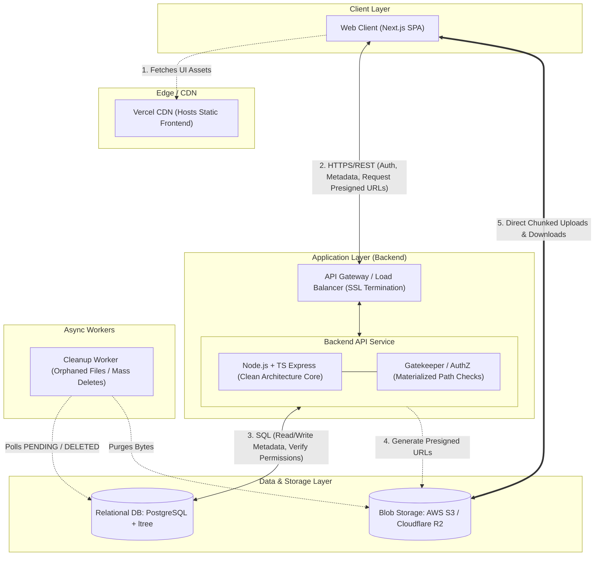

# Storify

> **Cloud-based Storage SaaS MVP** — Secure, scalable file storage, organization, and sharing designed with Clean Architecture and direct-to-cloud data streaming.

---

## Table of Contents

- [Overview](#overview)
- [Key Features](#key-features)
- [System Architecture](#system-architecture)
  - [Architectural Principles](#architectural-principles)
  - [High-Level Architecture Diagram](#high-level-architecture-diagram)
  - [Data Flow & Request Lifecycle](#data-flow--request-lifecycle)
- [Technology Stack](#technology-stack)
- [Repository Structure](#repository-structure)
- [Architecture Decision Records (ADRs)](#architecture-decision-records-adrs)
- [Scope & Non-Goals](#scope--non-goals)
- [Getting Started](#getting-started)
  - [Prerequisites](#prerequisites)
  - [Backend Setup](#backend-setup)
  - [Frontend Setup](#frontend-setup)
- [Testing & Engineering Guidelines](#testing--engineering-guidelines)
- [Documentation Index](#documentation-index)

---

## Overview

**Storify** is an open-source cloud storage platform (similar to Google Drive) built for individuals, students, and small teams. The platform emphasizes production-grade architecture, strict data consistency, predictable latency (< 200ms for metadata operations), and robust access control.

Beyond serving as a reliable storage solution, Storify is engineered to demonstrate **Low-Level Design (LLD)** and **Clean Architecture (Hexagonal / Ports and Adapters)** best practices, ensuring strict isolation between core business logic and external infrastructure.

---

## Key Features

### 📁 Files & Folders
- **1GB File Upload Support:** Multipart and chunked upload handling for files up to 1GB.
- **Direct-to-Cloud Uploads:** File streams bypass the API server entirely, uploading directly from the browser to blob storage using time-limited Pre-signed URLs.
- **Infinitely Nested Folders:** Structured using the **Materialized Path** (`ltree`) pattern for high-performance hierarchy traversal.

### 🔐 Access Control & Permissions
- **Role-Based Access Control (RBAC):**
  - **Owner:** Full access, ability to transfer ownership.
  - **Editor:** Can modify file content/metadata, generate public links, and delete files they uploaded.
  - **Viewer:** Read-only and download access.
  - **Public User:** Tokenized access via shared link.
- **Strict Downward Inheritance:** Permissions on a parent folder strictly cascade down the entire descendant tree without lower-level overrides.
- **Public Share Links:** Share files or folders via unique URLs with optional expiration dates and optional password protection.

### 🔍 Organization & Management
- **Search & Filtering:** Fast metadata search by filename, extension, size, and modification dates.
- **Favorites:** Star files and folders for instant access.
- **Trash & Restore:** Soft-delete mechanism with an interactive Trash bin for restoring or permanently purging files.

---

## System Architecture

Storify is designed around a **Traditional 3-Tier Macro Architecture** with decoupled metadata and binary streaming layers.

```
┌─────────────────────────────────────────────────────────────┐
│                        Client Layer                         │
│                    (Next.js React SPA)                      │
└───────────────┬─────────────────────────────┬───────────────┘
                │ 1. Metadata / Presigned URL │ 2. Direct Bytes
                ▼                             ▼
┌───────────────────────────────┐     ┌───────────────────────┐
│     Backend API Service       │     │     Blob Storage      │
│  (Node.js + TS Express Core)  │     │ (AWS S3 / Cloudflare) │
└───────────────┬───────────────┘     └───────────────────────┘
                │ 3. SQL / ACID Metadata
                ▼
┌───────────────────────────────┐
│      Relational Database      │
│     (PostgreSQL + ltree)      │
└───────────────────────────────┘
```

### Architectural Principles

1. **Direct-to-Cloud Byte Transfers:** Heavy binary data is never proxied through the Backend API. The API service verifies permissions and generates time-limited Pre-signed S3 URLs; the client performs chunked uploads/downloads directly against Object Storage.
2. **Clean Architecture in Backend (Ports & Adapters):** Strict inward dependency rule. Domain Entities and Use Cases are pure TypeScript with zero dependencies on frameworks (Express), ORMs, or database/cloud SDKs ([ADR 003](docs/decisions/003-adopt-clean-architecture.md)).
3. **Application-Level Authorization:** The API layer acts as the sole gatekeeper. Authorization, role resolution, and Materialized Path downward inheritance are evaluated explicitly within application Use Cases rather than relying on database Row Level Security (RLS) ([ADR 002](docs/decisions/002-enforce-authorization-in-application-layer.md)).
4. **Strong Metadata Consistency:** Relational metadata (folders, files, shares, permissions) is stored in PostgreSQL with ACID guarantees.
5. **Asynchronous Background Processing:** Heavy operations such as cleaning up abandoned `PENDING` uploads and cascading mass folder deletions are handled by asynchronous workers to avoid blocking HTTP lifecycles.

### High-Level Architecture Diagram



### Data Flow & Request Lifecycle

#### Direct-to-Cloud Upload Flow
1. **Request Upload:** Client sends `POST /files/upload-url` with target folder ID and file metadata.
2. **Authorize & Validate:** API Use Case verifies that the user has `Editor` or `Owner` permissions on the folder's Materialized Path.
3. **Issue Pre-signed URL:** API creates an S3 Adapter session to generate Pre-signed URLs for multipart upload.
4. **Store Pending Record:** Metadata record created in PostgreSQL with `status: PENDING`.
5. **Direct Transfer:** Client uploads chunks directly to AWS S3 / Cloudflare R2.
6. **Finalize:** Client invokes `POST /files/:id/complete`. The API verifies object existence in S3 and promotes status to `COMPLETED`.

---

## Technology Stack

| Layer | Technology | Description |
| :--- | :--- | :--- |
| **Frontend Client** | **Next.js (React)** | Dashboard UI, state management, client-side chunking & direct upload orchestrator. |
| **Backend API** | **Node.js + TypeScript (Express)** | Clean Architecture backend with strictly typed ports, adapters, and domain use cases. |
| **Database** | **PostgreSQL** | Relational metadata store utilizing `ltree` extension for tree hierarchy queries. |
| **Blob Storage** | **AWS S3 / Cloudflare R2** | Scalable object storage for binary payloads up to 1GB. |
| **Authentication** | **OAuth 2.0 / JWT** | Token-based stateless authentication with identity providers (Google/Auth0). |
| **Frontend Hosting** | **Vercel** | Global CDN and edge hosting for static and SSR frontend assets. |
| **Backend Hosting** | **Docker Container** | Containerized backend deployed on managed container platforms (ECS / Cloud Run / Render). |

---

## Repository Structure

```
storify/
├── .agents/                      # Workspace AI agent skills and automation tools
│   ├── adr-recorder/             # Tooling to record architecture decision records
│   └── system-overview-recorder/ # Tooling to maintain system overview docs
├── docs/                         # Authoritative architecture and product documentation
│   ├── architecture/             # System design, HLD diagrams, tech stack specs
│   │   ├── high-level-design.md
│   │   ├── system-overview.md
│   │   └── tech-stack.md
│   ├── decisions/                # Architecture Decision Records (ADRs)
│   │   ├── 001-adopt-traditional-3-tier-architecture.md
│   │   ├── 002-enforce-authorization-in-application-layer.md
│   │   ├── 003-adopt-clean-architecture.md
│   │   ├── 004-use-ulid-for-resource-ids-and-ltree-paths.md
│   │   ├── 005-use-node-postgres-for-data-access.md
│   │   └── 006-deploy-background-worker-as-standalone-service.md
│   ├── development/              # Incremental roadmap & developer guides
│   │   └── roadmap.md
│   └── product/                  # PRD and product requirements
│       └── requirements.md
├── storify-backend/              # Express + TypeScript Clean Architecture backend
└── storify-frontend/             # Next.js React frontend client
```

---

## Architecture Decision Records (ADRs)

Key architectural choices are documented in `docs/decisions/`:

- [ADR 001: Adopt Traditional 3-Tier Architecture](docs/decisions/001-adopt-traditional-3-tier-architecture.md) — Centralized business logic and predictable connection pooling over BaaS/Serverless.
- [ADR 002: Enforce Authorization in Application Layer](docs/decisions/002-enforce-authorization-in-application-layer.md) — Application-level gatekeeping for Materialized Path permissions rather than DB Row Level Security.
- [ADR 003: Adopt Clean Architecture for Backend](docs/decisions/003-adopt-clean-architecture.md) — Hexagonal architecture / Ports & Adapters to maximize testability and enforce Low-Level Design (LLD) principles.
- [ADR 004: Use ULID for Resource IDs and ltree Paths](docs/decisions/004-use-ulid-for-resource-ids-and-ltree-paths.md) — 26-character Base32 ULIDs for native `ltree` compatibility, decentralized ID generation, and zero B-Tree index fragmentation.
- [ADR 005: Use node-postgres for Data Access](docs/decisions/005-use-node-postgres-for-data-access.md) — Native `pg` connection pool inside repository adapters for direct SQL and `ltree` operator control.
- [ADR 006: Deploy Background Worker as Standalone Service](docs/decisions/006-deploy-background-worker-as-standalone-service.md) — Separate worker container for asynchronous upload sweeps and cascaded deletions.
- [ADR 007: Store Normalized Folder Reference for Files](docs/decisions/007-store-normalized-folder-reference-for-files.md) — Foreign key `folder_id` on files with `ltree` exclusively on folders to ensure $O(\text{subfolders})$ moves.
- [ADR 008: Adopt Hybrid Direct-to-Cloud Upload Strategy](docs/decisions/008-adopt-hybrid-direct-to-cloud-upload-strategy.md) — Single Pre-signed PUT for < 10MB and backend-orchestrated S3 multipart uploads for ≥ 10MB.
- [ADR 009: Auto-Rename on Filename Collision](docs/decisions/009-auto-rename-on-filename-collision.md) — Increment suffix (e.g. `file (1).pdf`) on duplicate file upload to prevent accidental data loss.
- [ADR 010: Target-Only Soft-Delete with Ancestor Trash Resolution](docs/decisions/010-target-only-soft-delete-with-ancestor-trash-resolution.md) — $O(1)$ soft-deleting on target row only, with query-time ancestor checks and parent-dependent restoration.
- [ADR 011: Parent-ID Navigation with Path-Based Access Control](docs/decisions/011-parent-id-navigation-with-path-based-access-control.md) — Decouple navigation (`parent_id`) from ownership filtering to cleanly separate "My Drive" and "Shared with Me".

---

## Scope & Non-Goals

### Supported in MVP
- Infinitely nested folder navigation (`ltree`).
- Direct-to-cloud multipart file uploads (up to 1GB).
- Strict downward permission inheritance (Owner, Editor, Viewer).
- Public link generation with optional passwords & expiration dates.
- Metadata search, favorites, soft-delete, and trash restoration.
- Asynchronous garbage collection of abandoned uploads and mass deletes.

### Out of Scope (Non-Goals for MVP)
- **File Versioning:** Tracking historical revisions of a file.
- **Server-Side Previews & Transcoding:** Video transcoding, audio waveform extraction, or server-generated document thumbnails.
- **Audit Logging:** Detailed access logs recording every file download or view event.
- **Granular Permission Overrides:** Explicit overrides or permission revocations on child items that contradict parent permissions.

---

## Getting Started

### Prerequisites
- **Node.js**: `v20.x` or higher
- **npm** or **pnpm**
- **Docker** & **Docker Compose** (for PostgreSQL database)
- **AWS Account** or **Cloudflare R2** (for S3-compatible blob storage credentials)

---

## Testing & Engineering Guidelines

When contributing to Storify, adhere to the following rules (see [AGENTS.md](AGENTS.md) for full agent guidelines):

- **Inward Dependency Rule:** Use Cases and Entities must never import HTTP drivers, Express controllers, ORMs, or database clients.
- **Ports & Adapters:** Use cases communicate exclusively with interfaces (`IFileRepository`, `IFolderRepository`, `IStorageProvider`).
- **Unit Testing:** Write fast, isolated unit tests for domain entities and use cases using in-memory stubs/mocks.
- **Integration Testing:** Test database adapters (`PostgreSQLRepository`) and storage adapters against real test containers.

---

## Documentation Index

- **Product Specifications:** [docs/product/requirements.md](docs/product/requirements.md)
- **Implementation Roadmap:** [docs/development/roadmap.md](docs/development/roadmap.md)
- **System Overview:** [docs/architecture/system-overview.md](docs/architecture/system-overview.md)
- **High-Level Design:** [docs/architecture/high-level-design.md](docs/architecture/high-level-design.md)
- **Tech Stack Specification:** [docs/architecture/tech-stack.md](docs/architecture/tech-stack.md)
- **Engineering & AI Agent Rules:** [AGENTS.md](AGENTS.md)
