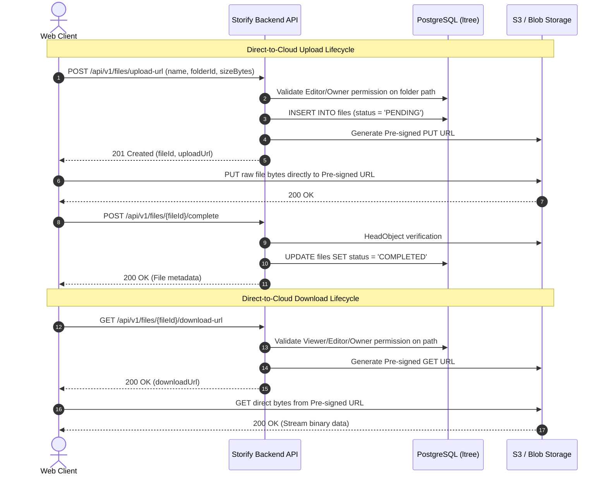

# Storify — REST API Specification

This document defines the complete HTTP REST API surface for the Storify platform, establishing the contract between the Next.js Frontend Client, Backend API Service, and Public Link consumers.

The corresponding machine-readable specification is available in [openapi.yaml](openapi.yaml).

---

## Table of Contents
1. [General Conventions & Base URLs](#1-general-conventions--base-urls)
2. [Authentication & Authorization](#2-authentication--authorization)
3. [Error Handling & Envelope Format](#3-error-handling--envelope-format)
4. [Endpoint Catalog](#4-endpoint-catalog)
   - [4.1 Users & Authentication](#41-users--authentication)
   - [4.2 Folders](#42-folders)
   - [4.3 Files & Direct-to-Cloud Transfers](#43-files--direct-to-cloud-transfers)
   - [4.4 Permissions & Collaboration](#44-permissions--collaboration)
   - [4.5 Public Share Links](#45-public-share-links)
   - [4.6 Trash & Permanent Purging](#46-trash--permanent-purging)
   - [4.7 Starred Items](#47-starred-items)
   - [4.8 Search](#48-search)
5. [End-to-End Direct Transfer Workflows](#5-end-to-end-direct-transfer-workflows)

---

## 1. General Conventions & Base URLs

- **Base URL:** `/api/v1`
- **Identifier Format:** 26-character Crockford Base32 ULIDs (e.g. `01HGF000000000000000000001`).
- **Content Types:** All requests with payloads must specify `Content-Type: application/json`. All responses return JSON unless serving binary redirects.
- **Date Formatting:** ISO 8601 UTC timestamps (e.g. `2026-09-02T12:00:00Z`).

---

## 2. Authentication & Authorization

### 2.1 Authenticated User Requests
All standard application routes require a valid user JWT in the `Authorization` header:
```http
Authorization: Bearer <user_jwt_token>
```
The Backend API verifies the signature, extracts the user ULID, and validates application-level access permissions using Materialized Path ancestry checks ([ADR 002](../decisions/002-enforce-authorization-in-application-layer.md)).

### 2.2 Public Link Consumers
Public endpoints (`/public/...`) do not require user authentication. If a public share link is password-protected, clients must first call `/public/links/{token}/unlock` to receive a scoped public token, passed as:
```http
Authorization: Bearer <scoped_public_token>
```

---

## 3. Error Handling & Envelope Format

All non-2xx responses return a consistent error envelope:

```json
{
  "code": "FORBIDDEN",
  "message": "You do not have permission to perform this action on the target folder.",
  "details": {}
}
```

| HTTP Status | Error Code | Description |
| :--- | :--- | :--- |
| `400 Bad Request` | `VALIDATION_ERROR` / `BAD_REQUEST` | Malformed parameters, payload invalid, or 1GB size limit exceeded. |
| `401 Unauthorized` | `UNAUTHORIZED` | Missing, invalid, or expired JWT. |
| `403 Forbidden` | `FORBIDDEN` | User does not have sufficient role on the resource or its parent path. |
| `404 Not Found` | `NOT_FOUND` | Target resource does not exist or is soft-deleted. |
| `409 Conflict` | `NAME_COLLISION` | Item with same name exists in active folder (auto-rename flow triggers). |
| `410 Gone` | `LINK_EXPIRED` | Public share link TTL has expired. |
| `500 Internal Error` | `INTERNAL_SERVER_ERROR` | Unexpected server or adapter failure. |

---

## 4. Endpoint Catalog

### 4.1 Users & Authentication

| Method | Endpoint | Description | Auth Required |
| :--- | :--- | :--- | :--- |
| `GET` | `/users/me` | Returns current user profile and `rootFolderId`. | Yes |
| `DELETE` | `/users/me` | Deletes user account and permanently cleans up all owned files/folders. | Yes |

---

### 4.2 Folders

| Method | Endpoint | Description | Auth Required | Minimum Role |
| :--- | :--- | :--- | :--- | :--- |
| `POST` | `/folders` | Creates a new subfolder in `parentId`. | Yes | `EDITOR` on parent |
| `GET` | `/folders/{id}` | Fetches folder metadata and immediate contents. `id` can be `'root'`. | Yes | `VIEWER` on folder/ancestor |
| `PATCH` | `/folders/{id}` | Renames folder. | Yes | `EDITOR` on folder/ancestor |
| `POST` | `/folders/{id}/move` | Moves folder to a new `targetParentId`. | Yes | `EDITOR` on both source & target |
| `DELETE` | `/folders/{id}` | Soft-deletes folder to Trash. | Yes | `OWNER` or `EDITOR` (own item only) |
| `POST` | `/folders/{id}/restore` | Restores soft-deleted folder from Trash. | Yes | `OWNER` / `EDITOR` |

#### `POST /folders` Request:
```json
{
  "name": "Project Roadmap",
  "parentId": "01HGF000000000000000000001"
}
```

---

### 4.3 Files & Direct-to-Cloud Transfers

| Method | Endpoint | Description | Auth Required | Minimum Role |
| :--- | :--- | :--- | :--- | :--- |
| `POST` | `/files/upload-url` | Initiates upload; creates `PENDING` file and returns pre-signed S3 URL. | Yes | `EDITOR` on folder |
| `POST` | `/files/{id}/complete` | Confirms direct S3 upload; transitions status from `PENDING` to `COMPLETED`. | Yes | `EDITOR` on folder |
| `GET` | `/files/{id}/download-url` | Generates short-lived pre-signed S3 download URL. | Yes | `VIEWER` on file/folder |
| `GET` | `/files/{id}` | Fetches file metadata. | Yes | `VIEWER` on file/folder |
| `PATCH` | `/files/{id}` | Renames file. | Yes | `EDITOR` on file/folder |
| `POST` | `/files/{id}/move` | Moves file to `targetFolderId`. | Yes | `EDITOR` on source & target |
| `DELETE` | `/files/{id}` | Soft-deletes file to Trash. | Yes | `OWNER` or `EDITOR` (own item only) |
| `POST` | `/files/{id}/restore` | Restores soft-deleted file from Trash. | Yes | `OWNER` / `EDITOR` |

#### `POST /files/upload-url` Request:
```json
{
  "name": "design_spec.pdf",
  "folderId": "01HGF000000000000000000001",
  "sizeBytes": 45000000,
  "mimeType": "application/pdf"
}
```

#### `POST /files/upload-url` Response:
```json
{
  "fileId": "01HGF000000000000000000099",
  "uploadStrategy": "SINGLE_PUT",
  "uploadUrl": "https://storify-storage.s3.amazonaws.com/uploads/01HGF...99?AWSAccessKeyId=...",
  "expiresInSeconds": 900
}
```

---

### 4.4 Permissions & Collaboration

| Method | Endpoint | Description | Auth Required | Minimum Role |
| :--- | :--- | :--- | :--- | :--- |
| `GET` | `/folders/{id}/permissions` | Lists all explicit collaborators on a folder. | Yes | `VIEWER` |
| `POST` | `/folders/{id}/permissions` | Grants a user `EDITOR` or `VIEWER` role on a folder. | Yes | `OWNER` or `EDITOR` |
| `GET` | `/files/{id}/permissions` | Lists all explicit collaborators on a file. | Yes | `VIEWER` |
| `POST` | `/files/{id}/permissions` | Grants a user `EDITOR` or `VIEWER` role on a file. | Yes | `OWNER` or `EDITOR` |
| `PATCH` | `/permissions/{id}` | Updates collaborator role level. | Yes | `OWNER` |
| `DELETE` | `/permissions/{id}` | Revokes collaborator access grant. | Yes | `OWNER` |
| `GET` | `/shared-with-me` | Lists top-level folder/file entry points shared with caller. | Yes | Authenticated User |

#### `POST /folders/{id}/permissions` Request:
```json
{
  "email": "teammate@example.com",
  "role": "EDITOR"
}
```

---

### 4.5 Public Share Links

#### Management (Authenticated):
| Method | Endpoint | Description | Auth Required | Minimum Role |
| :--- | :--- | :--- | :--- | :--- |
| `POST` | `/public-links` | Generates a shareable public URL with optional password/expiry. | Yes | `OWNER` or `EDITOR` |
| `GET` | `/public-links/{id}` | Fetches link settings and active state. | Yes | `OWNER` or `EDITOR` |
| `DELETE` | `/public-links/{id}` | Revokes and deletes a public share link. | Yes | `OWNER` or `EDITOR` |

#### Public Consumption (Unauthenticated / Public Token):
| Method | Endpoint | Description | Auth Required |
| :--- | :--- | :--- | :--- |
| `GET` | `/public/links/{token}` | Resolves link target name, type, and whether password is required. | None |
| `POST` | `/public/links/{token}/unlock` | Verifies password and issues short-lived scoped public JWT. | None |
| `GET` | `/public/links/{token}/folder` | Browses folder contents shared via public link. | Public JWT (if protected) |
| `GET` | `/public/links/{token}/download-url` | Generates direct-to-cloud download URL for shared file. | Public JWT (if protected) |

---

### 4.6 Trash & Permanent Purging

| Method | Endpoint | Description | Auth Required |
| :--- | :--- | :--- | :--- |
| `GET` | `/trash` | Lists top-level explicitly trashed folders and files for caller. | Yes |
| `DELETE` | `/trash/empty` | Async triggers background sweeper to permanently purge all user trash. | Yes |
| `DELETE` | `/folders/{id}/permanent` | Async queues permanent deletion of folder subtree and S3 bytes. | Yes (`OWNER`) |
| `DELETE` | `/files/{id}/permanent` | Permanently deletes file metadata and cloud object. | Yes (`OWNER`) |

---

### 4.7 Starred Items

| Method | Endpoint | Description | Auth Required |
| :--- | :--- | :--- | :--- |
| `GET` | `/starred` | Lists all starred folders and files for caller. | Yes |
| `POST` | `/starred` | Stars a target folder or file. | Yes |
| `DELETE` | `/starred/{id}` | Unstars the item. | Yes |

---

### 4.8 Search

| Method | Endpoint | Description | Query Parameters |
| :--- | :--- | :--- | :--- |
| `GET` | `/search` | Global search across accessible items. | `query` (text), `mimeType` (filter), `folderId` (scope) |

---

## 5. End-to-End Direct Transfer Workflows


