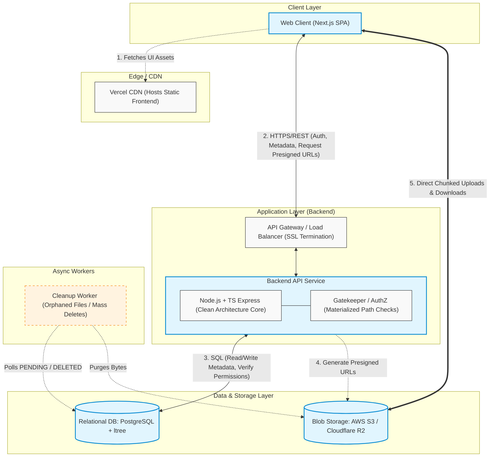

# High-Level Architecture Diagram

This document contains the high-level architecture diagram for the Storify system, illustrating the Traditional 3-Tier macro-architecture and the direct-to-cloud data flows.

## Flow Description
1. **Asset Delivery:** The user's browser fetches the Next.js frontend from the Vercel CDN.
2. **API Requests:** The client communicates with the Backend API (via a Load Balancer) for authentication, browsing folders, and requesting permission to upload/download files.
3. **Database Interactions:** The Backend API acts as the sole gatekeeper, querying PostgreSQL to verify Materialized Path inheritance permissions before acting.
4. **URL Orchestration:** To handle large 1GB files without choking the backend, the API calls the Blob Storage provider to generate secure, time-limited Pre-signed URLs.
5. **Direct-to-Cloud Transfer:** The client uses the Pre-signed URLs to stream bytes directly to and from Blob Storage, completely bypassing the Backend API for heavy lifting.
6. **Async Cleanup:** Background workers periodically sweep the database for abandoned (PENDING) uploads or large folder deletion requests, purging the corresponding bytes from Blob Storage without impacting real-time API performance.
