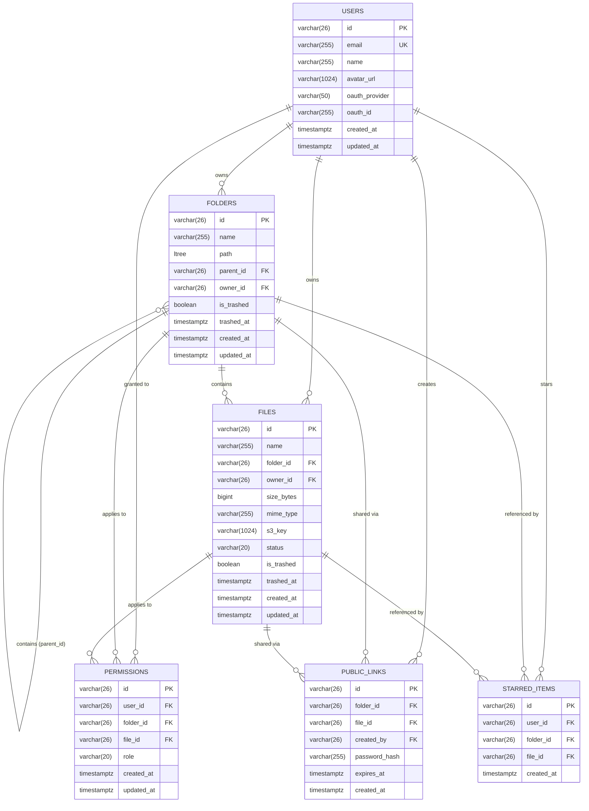

# Storify — Database Schema Specification

## Table of Contents
1. [Overview & Architectural Context](#1-overview--architectural-context)
2. [Database Extensions & Types](#2-database-extensions--types)
3. [Schema Diagram (ERD)](#3-schema-diagram-erd)
4. [Entities & Table Definitions](#4-entities--table-definitions)
   - [4.1 `users`](#41-users)
   - [4.2 `folders`](#42-folders)
   - [4.3 `files`](#43-files)
   - [4.4 `permissions`](#44-permissions)
   - [4.5 `public_links`](#45-public_links)
   - [4.6 `starred_items`](#46-starred_items)
5. [Indexing Strategy & Query Optimization](#5-indexing-strategy--query-optimization)
   - [5.1 Primary & Foreign Key Indexing](#51-primary--foreign-key-indexing)
   - [5.2 Hierarchy & Permission Checks (GiST on `ltree`)](#52-hierarchy--permission-checks-gist-on-ltree)
   - [5.3 Partial Indexes for Performance & Soft Deletes](#53-partial-indexes-for-performance--soft-deletes)
   - [5.4 Background Sweeper Indexes](#54-background-sweeper-indexes)
6. [Data Integrity & Lifecycle Rules](#6-data-integrity--lifecycle-rules)

---

## 1. Overview & Architectural Context

Storify uses PostgreSQL as its core metadata store, backed by the `ltree` extension for tree hierarchies and 26-character ULIDs for primary keys. In alignment with established architectural decisions:

- **Application-Level Authorization ([ADR 002](../decisions/002-enforce-authorization-in-application-layer.md)):** Access control is evaluated in backend use cases via `ltree` path containment rather than database-level Row Level Security (RLS).
- **ULID Identifiers ([ADR 004](../decisions/004-use-ulid-for-resource-ids-and-ltree-paths.md)):** Crockford Base32 26-character ULIDs are used across all primary keys and `ltree` path nodes (`[0-9A-HJKMNP-TV-Z]`), eliminating UUID hyphen transformation overhead and preventing B-Tree page splits.
- **Normalized File Hierarchy ([ADR 007](../decisions/007-store-normalized-folder-reference-for-files.md)):** Files store only a normalized `folder_id` foreign key. Materialized paths reside strictly on `folders`, ensuring subfolder move operations run in $O(\text{subfolders})$ rather than $O(\text{files})$.
- **Target-Only Soft Delete ([ADR 010](../decisions/010-target-only-soft-delete-with-ancestor-trash-resolution.md)):** Deleting a folder or file sets `is_trashed = true` strictly on the target record. Hierarchy containment queries filter items dynamically.
- **Parent-ID Driven Navigation ([ADR 011](../decisions/011-parent-id-navigation-with-path-based-access-control.md)):** Navigation relies on `parent_id` lookups ($O(1)$) while permissions are verified using the indexed `ltree` path.

---

## 2. Database Extensions & Types

```sql
-- Enable ltree extension for hierarchical materialized paths
CREATE EXTENSION IF NOT EXISTS ltree;
```

---

## 3. Schema Diagram (ERD)



---

## 4. Entities & Table Definitions

### 4.1 `users`
Stores authenticated user accounts and OAuth identity metadata.

| Column | Type | Constraints / Defaults | Description |
| :--- | :--- | :--- | :--- |
| `id` | `VARCHAR(26)` | `PRIMARY KEY` | Crockford Base32 ULID identifier. |
| `email` | `VARCHAR(255)` | `NOT NULL, UNIQUE` | Unique email address of the user. |
| `name` | `VARCHAR(255)` | `NOT NULL` | Display name of the user. |
| `avatar_url` | `VARCHAR(1024)` | `NULL` | Public avatar image URL. |
| `oauth_provider` | `VARCHAR(50)` | `NOT NULL` | Identity provider (e.g. `google`, `github`). |
| `oauth_id` | `VARCHAR(255)` | `NOT NULL` | Provider-specific unique subject identifier. |
| `created_at` | `TIMESTAMPTZ` | `NOT NULL, DEFAULT NOW()` | Record creation timestamp. |
| `updated_at` | `TIMESTAMPTZ` | `NOT NULL, DEFAULT NOW()` | Record last update timestamp. |

**Indexes & Constraints:**
- `users_pkey`: `PRIMARY KEY (id)`
- `uq_users_email`: `UNIQUE (email)`
- `uq_users_oauth`: `UNIQUE (oauth_provider, oauth_id)`

---

### 4.2 `folders`
Maintains the folder hierarchy using both parent references (for instant navigation) and `ltree` materialized paths (for descendant resolution and authorization).

| Column | Type | Constraints / Defaults | Description |
| :--- | :--- | :--- | :--- |
| `id` | `VARCHAR(26)` | `PRIMARY KEY` | Crockford Base32 ULID identifier. |
| `name` | `VARCHAR(255)` | `NOT NULL` | Display name of the folder. |
| `path` | `LTREE` | `NOT NULL` | Dot-separated ancestor ULID path (e.g., `01HGF...01HGX`). |
| `parent_id` | `VARCHAR(26)` | `NULL, REFERENCES folders(id) ON DELETE CASCADE` | Direct parent folder ID. `NULL` denotes a user's root folder ("My Drive"). |
| `owner_id` | `VARCHAR(26)` | `NOT NULL, REFERENCES users(id) ON DELETE CASCADE` | User who created/owns this folder. |
| `is_trashed` | `BOOLEAN` | `NOT NULL, DEFAULT FALSE` | Target-only soft-delete status flag. |
| `trashed_at` | `TIMESTAMPTZ` | `NULL` | Timestamp when target folder was moved to trash. |
| `created_at` | `TIMESTAMPTZ` | `NOT NULL, DEFAULT NOW()` | Record creation timestamp. |
| `updated_at` | `TIMESTAMPTZ` | `NOT NULL, DEFAULT NOW()` | Record last update timestamp. |

**Indexes & Constraints:**
- `folders_pkey`: `PRIMARY KEY (id)`
- `idx_folders_path_gist`: `GIST (path)` — powers subtree ancestry `@>` and `<@` checks.
- `idx_folders_parent_id`: `BTREE (parent_id)` — powers `GET /folders/:id` child listings ($O(1)$).
- `idx_folders_owner_id`: `BTREE (owner_id)` — powers user root folder lookup and quota aggregation.
- `uq_folders_active_name`: `UNIQUE (parent_id, name) WHERE is_trashed = false` — prevents active sibling naming collisions (ADR 009).

---

### 4.3 `files`
Stores file metadata, object storage references, and upload lifecycle states.

| Column | Type | Constraints / Defaults | Description |
| :--- | :--- | :--- | :--- |
| `id` | `VARCHAR(26)` | `PRIMARY KEY` | Crockford Base32 ULID identifier. |
| `name` | `VARCHAR(255)` | `NOT NULL` | Original filename including extension. |
| `folder_id` | `VARCHAR(26)` | `NOT NULL, REFERENCES folders(id) ON DELETE CASCADE` | Normalized reference to parent folder (ADR 007). |
| `owner_id` | `VARCHAR(26)` | `NOT NULL, REFERENCES users(id) ON DELETE CASCADE` | User who uploaded/owns this file. |
| `size_bytes` | `BIGINT` | `NOT NULL, CHECK (size_bytes >= 0 AND size_bytes <= 1073741824)` | File size in bytes (capped at 1GB limit). |
| `mime_type` | `VARCHAR(255)` | `NOT NULL` | Standard MIME content type. |
| `s3_key` | `VARCHAR(1024)` | `NOT NULL` | Target object key in AWS S3 / Cloudflare R2 bucket. |
| `status` | `VARCHAR(20)` | `NOT NULL, CHECK (status IN ('PENDING', 'COMPLETED'))` | Direct-to-cloud upload lifecycle state. |
| `is_trashed` | `BOOLEAN` | `NOT NULL, DEFAULT FALSE` | Target-only soft-delete status flag. |
| `trashed_at` | `TIMESTAMPTZ` | `NULL` | Timestamp when target file was moved to trash. |
| `created_at` | `TIMESTAMPTZ` | `NOT NULL, DEFAULT NOW()` | Record creation timestamp. |
| `updated_at` | `TIMESTAMPTZ` | `NOT NULL, DEFAULT NOW()` | Record last update timestamp. |

**Indexes & Constraints:**
- `files_pkey`: `PRIMARY KEY (id)`
- `idx_files_folder_id`: `BTREE (folder_id)` — powers listing files in a folder ($O(1)$).
- `idx_files_owner_id`: `BTREE (owner_id)` — powers quota calculations and owner filters.
- `idx_files_pending_cleanup`: `BTREE (created_at) WHERE status = 'PENDING'` — powers async background worker sweeps for abandoned uploads.
- `uq_files_active_name`: `UNIQUE (folder_id, name) WHERE is_trashed = false` — prevents active sibling naming collisions (ADR 009).

---

### 4.4 `permissions`
Explicit access grants for users on specific folders or files. Permissions on folders are inherited downward to all descendants.

| Column | Type | Constraints / Defaults | Description |
| :--- | :--- | :--- | :--- |
| `id` | `VARCHAR(26)` | `PRIMARY KEY` | Crockford Base32 ULID identifier. |
| `user_id` | `VARCHAR(26)` | `NOT NULL, REFERENCES users(id) ON DELETE CASCADE` | Grantee user identifier. |
| `folder_id` | `VARCHAR(26)` | `NULL, REFERENCES folders(id) ON DELETE CASCADE` | Target folder ID (if folder grant). |
| `file_id` | `VARCHAR(26)` | `NULL, REFERENCES files(id) ON DELETE CASCADE` | Target file ID (if single file grant). |
| `role` | `VARCHAR(20)` | `NOT NULL, CHECK (role IN ('OWNER', 'EDITOR', 'VIEWER'))` | Assigned role privilege level. |
| `created_at` | `TIMESTAMPTZ` | `NOT NULL, DEFAULT NOW()` | Record creation timestamp. |
| `updated_at` | `TIMESTAMPTZ` | `NOT NULL, DEFAULT NOW()` | Record last update timestamp. |

**Indexes & Constraints:**
- `permissions_pkey`: `PRIMARY KEY (id)`
- `chk_permissions_target`: `CHECK ((folder_id IS NOT NULL AND file_id IS NULL) OR (folder_id IS NULL AND file_id IS NOT NULL))`
- `uq_permissions_user_folder`: `UNIQUE (user_id, folder_id)`
- `uq_permissions_user_file`: `UNIQUE (user_id, file_id)`
- `idx_permissions_user_id`: `BTREE (user_id)` — powers "Shared with Me" entry point queries.
- `idx_permissions_folder_id`: `BTREE (folder_id)` — powers folder collaborator lookups.
- `idx_permissions_file_id`: `BTREE (file_id)` — powers file collaborator lookups.

---

### 4.5 `public_links`
Manages tokenized public share links with optional password protection and TTL expiration.

| Column | Type | Constraints / Defaults | Description |
| :--- | :--- | :--- | :--- |
| `id` | `VARCHAR(26)` | `PRIMARY KEY` | Crockford Base32 ULID / Public access token identifier. |
| `folder_id` | `VARCHAR(26)` | `NULL, REFERENCES folders(id) ON DELETE CASCADE` | Shared folder ID (if folder link). |
| `file_id` | `VARCHAR(26)` | `NULL, REFERENCES files(id) ON DELETE CASCADE` | Shared file ID (if file link). |
| `created_by` | `VARCHAR(26)` | `NOT NULL, REFERENCES users(id) ON DELETE CASCADE` | User who created the share link. |
| `password_hash` | `VARCHAR(255)` | `NULL` | Bcrypt / Argon2 hash for password-protected links. |
| `expires_at` | `TIMESTAMPTZ` | `NULL` | Optional link expiration timestamp. |
| `created_at` | `TIMESTAMPTZ` | `NOT NULL, DEFAULT NOW()` | Record creation timestamp. |

**Indexes & Constraints:**
- `public_links_pkey`: `PRIMARY KEY (id)`
- `chk_public_links_target`: `CHECK ((folder_id IS NOT NULL AND file_id IS NULL) OR (folder_id IS NULL AND file_id IS NOT NULL))`
- `idx_public_links_folder_id`: `BTREE (folder_id)`
- `idx_public_links_file_id`: `BTREE (file_id)`

---

### 4.6 `starred_items`
Stores user-specific bookmarks ("starred" or "favorited" items) for quick dashboard access.

| Column | Type | Constraints / Defaults | Description |
| :--- | :--- | :--- | :--- |
| `id` | `VARCHAR(26)` | `PRIMARY KEY` | Crockford Base32 ULID identifier. |
| `user_id` | `VARCHAR(26)` | `NOT NULL, REFERENCES users(id) ON DELETE CASCADE` | User who starred the item. |
| `folder_id` | `VARCHAR(26)` | `NULL, REFERENCES folders(id) ON DELETE CASCADE` | Starred folder (if folder). |
| `file_id` | `VARCHAR(26)` | `NULL, REFERENCES files(id) ON DELETE CASCADE` | Starred file (if file). |
| `created_at` | `TIMESTAMPTZ` | `NOT NULL, DEFAULT NOW()` | Record creation timestamp. |

**Indexes & Constraints:**
- `starred_items_pkey`: `PRIMARY KEY (id)`
- `chk_starred_target`: `CHECK ((folder_id IS NOT NULL AND file_id IS NULL) OR (folder_id IS NULL AND file_id IS NOT NULL))`
- `uq_starred_user_folder`: `UNIQUE (user_id, folder_id)`
- `uq_starred_user_file`: `UNIQUE (user_id, file_id)`
- `idx_starred_user_id`: `BTREE (user_id)`

---

## 5. Indexing Strategy & Query Optimization

To guarantee sub-200ms latency across metadata operations, the indexing strategy is tailored for three distinct query access patterns:

### 5.1 Primary & Foreign Key Indexing
All tables use 26-character ULIDs encoded as `VARCHAR(26)`. Because ULIDs feature a 48-bit timestamp prefix, B-Tree index inserts are monotonically increasing, avoiding random page splits common to UUIDv4.

All foreign key relationships (`parent_id`, `folder_id`, `owner_id`, `user_id`) are explicitly indexed with standard B-Trees to ensure fast joins and cascade triggers.

### 5.2 Hierarchy & Permission Checks (GiST on `ltree`)
The `folders.path` column uses a Generalized Search Tree (GiST) index:
```sql
CREATE INDEX idx_folders_path_gist ON folders USING GIST (path);
```

**Downward Permission Evaluation:**
When evaluating whether user $U$ can access folder $F$ located at path $P$, the query joins $U$'s explicit permissions against all ancestor nodes along $P$:
```sql
SELECT p.role
FROM permissions p
JOIN folders f ON p.folder_id = f.id
WHERE p.user_id = $userId
  AND f.path @> $targetFolderPath
ORDER BY nlevel(f.path) DESC
LIMIT 1;
```
The GiST index evaluates path containment (`f.path @> $targetFolderPath`) in logarithmic time, ensuring authorization resolution remains `< 200ms` even in deep folder hierarchies.

### 5.3 Partial Indexes for Performance & Soft Deletes
Soft delete queries frequently filter on `is_trashed = false`. Partial unique indexes enforce sibling naming rules only across active items:

```sql
-- Enforce unique folder names among active siblings in the same directory
CREATE UNIQUE INDEX uq_folders_active_name 
ON folders (parent_id, name) 
WHERE is_trashed = false;

-- Enforce unique filenames among active files in the same directory
CREATE UNIQUE INDEX uq_files_active_name 
ON files (folder_id, name) 
WHERE is_trashed = false;
```

### 5.4 Background Sweeper Indexes
The standalone background worker routinely identifies abandoned uploads that never completed:
```sql
CREATE INDEX idx_files_pending_cleanup 
ON files (created_at) 
WHERE status = 'PENDING';
```
This partial index isolates pending uploads, allowing the background cleaner to execute `SELECT * FROM files WHERE status = 'PENDING' AND created_at < NOW() - INTERVAL '2 hours'` via a lightweight index scan without scanning millions of active `COMPLETED` records.

---

## 6. Data Integrity & Lifecycle Rules

1. **User Root Folder Lifecycle:**
   - When a user registers, a default root folder is provisioned with `parent_id = NULL`, `name = 'My Drive'`, and `path = $rootFolderUlid`.
   - The user's root folder cannot be deleted, moved, or trashed.
2. **Normalized Moves:**
   - Moving a folder updates only the target folder and its subfolders using `path = $newParentPath || subpath(path, nlevel($oldParentPath))`.
   - The `files` table is untouched during moves since it references `folder_id` directly.
3. **Cascading Deletions:**
   - Hard deletion cascades via foreign keys: deleting a user or folder removes its related permissions, public links, and starred bookmarks cleanly at the database engine level.
