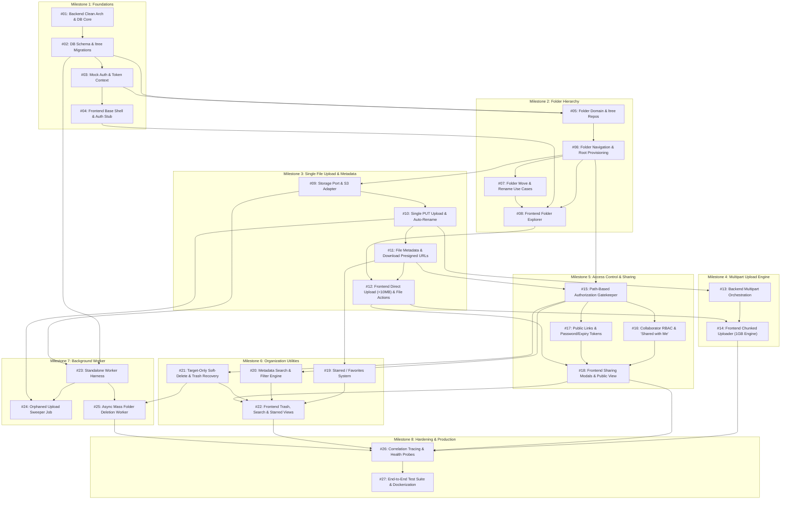

# Storify: Incremental Implementation Roadmap

This document defines the incremental implementation roadmap for the Storify Cloud Storage platform. The roadmap is decomposed into **8 incremental, testable vertical slices** (milestones). Each milestone delivers demonstrable, end-to-end functionality—avoiding monolithic dependencies where testing must wait for the entire system to be built.

All items strictly follow the architectural constraints documented in [requirements.md](../product/requirements.md), [system-overview.md](../architecture/system-overview.md), [high-level-design.md](../architecture/high-level-design.md), [tech-stack.md](../architecture/tech-stack.md), and [ADRs 001–011](../decisions/).

---

## 🗺️ Feature Dependency Graph

---

## 📦 Milestone 1: Project Foundation & Core Domain Scaffolding (Vertical Slice 0)

> **Objective:** Establish the Clean Architecture folder structure, PostgreSQL connection pooling with `pg`, schema migrations with `ltree` support, ULID identifier utilities, and stateless authentication context without business logic bloat.

### Feature 1.1: Clean Architecture Backend Core & Database Infrastructure
* **Description:** Initialize `storify-backend` with TypeScript, ESLint, error-handling middleware, and connection pool wrappers for PostgreSQL via `pg`.
* **ADR Compliance:** [ADR 001](../decisions/001-adopt-traditional-3-tier-architecture.md), [ADR 003](../decisions/003-adopt-clean-architecture.md), [ADR 005](../decisions/005-use-node-postgres-for-data-access.md).

#### GitHub Issue #01: Backend Clean Architecture Boilerplate & Database Driver Setup
- **Type:** Infrastructure / Backend
- **Dependencies:** None
- **Scope:**
  - Setup TypeScript project layout: `src/core/entities`, `src/core/use-cases`, `src/core/ports`, `src/adapters/controllers`, `src/adapters/repositories`, `src/infrastructure/database`, `src/infrastructure/http`.
  - Implement `DatabaseConnectionPool` wrapping `pg.Pool` with parameterized query runner and transaction helper.
  - Implement ULID generation utility conforming to 26-character Crockford Base32 ([ADR 004](../decisions/004-use-ulid-for-resource-ids-and-ltree-paths.md)).
- **Acceptance Criteria:**
  - Express server starts and exposes `GET /health` responding with `200 OK` and `{ status: "UP", database: "CONNECTED" }`.
  - Database pool gracefully acquires and releases clients without leaking connections.
  - Core domain directory contains zero imports from `express`, `pg`, or third-party infrastructure SDKs.
- **Testing Requirements:**
  - *Unit Tests:* Test ULID generation conforms to regex `^[0-9A-HJKMNP-TV-Z]{26}$` and is sortable.
  - *Integration Tests:* Verify `pg.Pool` connection acquisition, execution of `SELECT 1`, and rollback behavior on transaction errors against PostgreSQL test container.

---

### Feature 1.2: Relational Schema & Materialized Path Migrations
* **Description:** Raw SQL migrations setting up PostgreSQL `ltree` extension, tables (`users`, `folders`, `files`, `permissions`, `public_shares`), and GiST / B-Tree indices.
* **ADR Compliance:** [ADR 004](../decisions/004-use-ulid-for-resource-ids-and-ltree-paths.md), [ADR 007](../decisions/007-store-normalized-folder-reference-for-files.md), [ADR 010](../decisions/010-target-only-soft-delete-with-ancestor-trash-resolution.md).

#### GitHub Issue #02: Database Migration Scripts & Core Relational Schema
- **Type:** Database / Backend
- **Dependencies:** #01
- **Scope:**
  - Migration script to enable `CREATE EXTENSION IF NOT EXISTS ltree;`.
  - Tables creation:
    - `users`: `id VARCHAR(26) PRIMARY KEY`, `email`, `name`, `root_folder_id VARCHAR(26)`.
    - `folders`: `id VARCHAR(26) PRIMARY KEY`, `name`, `parent_id VARCHAR(26)`, `path LTREE NOT NULL`, `owner_id VARCHAR(26)`, `is_starred BOOLEAN`, `is_trashed BOOLEAN`, `trashed_at TIMESTAMP`, `created_at`, `updated_at`.
    - `files`: `id VARCHAR(26) PRIMARY KEY`, `name`, `folder_id VARCHAR(26) NOT NULL`, `owner_id VARCHAR(26)`, `size_bytes BIGINT`, `mime_type`, `s3_key`, `status VARCHAR(20)` (`PENDING` | `COMPLETED`), `is_starred BOOLEAN`, `is_trashed BOOLEAN`, `trashed_at TIMESTAMP`, `created_at`, `updated_at`.
    - `permissions`: `id VARCHAR(26) PRIMARY KEY`, `resource_id VARCHAR(26)`, `resource_type` (`FOLDER`), `user_id VARCHAR(26)`, `role` (`OWNER` | `EDITOR` | `VIEWER`).
    - `public_shares`: `id VARCHAR(26) PRIMARY KEY`, `resource_id VARCHAR(26)`, `resource_type`, `token VARCHAR(64) UNIQUE`, `password_hash`, `expires_at`, `created_at`.
  - Indices: GiST index on `folders(path)`, B-Tree on `folders(parent_id)`, `files(folder_id)`, `files(folder_id, name)`, `folders(owner_id)`, `files(owner_id)`.
- **Acceptance Criteria:**
  - Up/down migration scripts execute cleanly in local and CI database containers.
  - Insert query with valid ULID and `ltree` path (e.g. `01ARZ3NDEKTSV4RRFFQ69G5FAV.01ARZ3NDEKTSV4RRFFQ69G5FAW`) succeeds without format rejection.
- **Testing Requirements:**
  - *Integration Tests:* Verify foreign key constraints, `ltree` operator compatibility (`@>`, `<@`), and unique index checks for duplicate active files in same folder.

---

### Feature 1.3: Authentication & Identity Context Middleware
* **Description:** Stateless JWT verification and user identity injection with local mock OAuth support.
* **ADR Compliance:** [ADR 002](../decisions/002-enforce-authorization-in-application-layer.md).

#### GitHub Issue #03: Stateless JWT Auth Middleware & Dev Mock Identity Provider
- **Type:** Security / Backend
- **Dependencies:** #02
- **Scope:**
  - Implement JWT extraction and decoding middleware (`src/infrastructure/http/middleware/auth.middleware.ts`).
  - Implement `/auth/mock-token` endpoint for local development/testing to mint tokens for test users.
  - Populate strongly typed `UserContext` (`{ userId, email, rootFolderId }`) on incoming Express requests.
- **Acceptance Criteria:**
  - Requests missing `Authorization: Bearer <token>` or with invalid signatures on protected routes return `401 Unauthorized`.
  - Valid token attaches authenticated `UserContext` accessible in subsequent Clean Architecture controllers.
- **Testing Requirements:**
  - *Unit Tests:* Test token parsing, expiration rejection, and malformed token handling.
  - *Contract Tests:* Test protected endpoint returns `401` without header and `200` with signed test token.

---

### Feature 1.4: Frontend Client Shell & Auth Context
* **Description:** Initialize `storify-frontend` using Next.js (App Router), Vanilla CSS tokens, state provider for mock/JWT auth, and layout shells.

#### GitHub Issue #04: Next.js Frontend Shell, Theme Tokens & Auth State Provider
- **Type:** Frontend
- **Dependencies:** #03
- **Scope:**
  - Setup Next.js application with TypeScript and Vanilla CSS variables (colors, typography, elevation).
  - Create `AuthProvider` managing user session, token storage, and mock switchable test users.
  - Build navigation layout skeleton (Sidebar: My Drive, Shared with Me, Starred, Trash; Top Header: Search bar, User profile).
- **Acceptance Criteria:**
  - Application renders responsive desktop and mobile layouts.
  - Switching test user in dev mode updates active JWT stored in local state and re-renders layout.
- **Testing Requirements:**
  - *Component Tests:* Verify sidebar navigation items render and route correctly.

---

## 📁 Milestone 2: Hierarchical Folder Management & Navigation (Vertical Slice 1)

> **Objective:** Deliver fully functional folder creation, nested subfolders, instant tree navigation via `parent_id` lookups, and recursive `ltree` path renaming/moving.

### Feature 2.1: Folder Entity, Repository & Creation Use Cases
* **Description:** Pure domain entity for `Folder`, `IFolderRepository` port, PostgreSQL adapter using `pg`, and use cases for provisioning root folders and creating nested subfolders.
* **ADR Compliance:** [ADR 003](../decisions/003-adopt-clean-architecture.md), [ADR 004](../decisions/004-use-ulid-for-resource-ids-and-ltree-paths.md), [ADR 011](../decisions/011-parent-id-navigation-with-path-based-access-control.md).

#### GitHub Issue #05: Folder Domain Entity, Repository Port & PostgreSQL ltree Adapter
- **Type:** Backend Core & Adapter
- **Dependencies:** #02, #03
- **Scope:**
  - Create `Folder` domain entity in `src/core/entities/folder.entity.ts`.
  - Define `IFolderRepository` port with methods: `create`, `findById`, `findByParentId`, `updatePathSubtree`, `findAncestorsByPath`.
  - Implement `PostgresFolderRepository` executing raw SQL for path calculation (`parent.path || folder.id`).
  - Implement `CreateFolderUseCase` validating parent folder existence and assembling the `ltree` path.
- **Acceptance Criteria:**
  - Creating a root folder sets `path = id` and `parent_id = NULL`.
  - Creating a child folder sets `parent_id = parent.id` and `path = parent.path || '.' || child.id`.
- **Testing Requirements:**
  - *Unit Tests:* Test `CreateFolderUseCase` with an in-memory `MockFolderRepository`.
  - *Integration Tests:* Verify `PostgresFolderRepository` inserts and fetches folders, and that `ltree` path matches expected dot-separated ULIDs.

---

### Feature 2.2: Folder Navigation & Content Listing
* **Description:** API endpoints and use cases for listing folder contents (`parent_id`) and retrieving breadcrumb ancestry (`ltree`).
* **ADR Compliance:** [ADR 011](../decisions/011-parent-id-navigation-with-path-based-access-control.md).

#### GitHub Issue #06: Folder Content Listing & Breadcrumb Resolution Use Cases
- **Type:** Backend API
- **Dependencies:** #05
- **Scope:**
  - Implement `ListFolderContentsUseCase`: Fetch immediate subfolders and files for a target `folder_id` (defaults to user root if empty).
  - Implement `GetFolderBreadcrumbsUseCase`: Query ancestor folders using PostgreSQL `path @> target.path` sorted by `nlevel(path)`.
  - Expose `GET /folders/:id` and `GET /folders/root` Express routes.
- **Acceptance Criteria:**
  - `GET /folders/:id` returns immediate children in `< 200ms`.
  - Response includes an ordered `breadcrumbs` array from root down to current folder.
  - Requesting an inaccessible or non-existent folder returns `404 Not Found` or `403 Forbidden`.
- **Testing Requirements:**
  - *Unit Tests:* Test breadcrumb ordering logic in isolation.
  - *Integration Tests:* Verify querying 5-level deep folder returns exactly 5 ordered breadcrumb nodes using `ltree` ancestor query.

---

### Feature 2.3: Folder Move & Rename with Subtree Path Rewriting
* **Description:** Fast folder renaming and moving across hierarchy by executing single prefix-replacement SQL query.
* **ADR Compliance:** [ADR 007](../decisions/007-store-normalized-folder-reference-for-files.md).

#### GitHub Issue #07: Folder Move & Rename Use Cases with Atomic Subtree Rewriting
- **Type:** Backend Core & Adapter
- **Dependencies:** #06
- **Scope:**
  - Implement `RenameFolderUseCase`: Updates folder `name` without modifying `ltree` path.
  - Implement `MoveFolderUseCase`: Reparents folder to `new_parent_id` and updates all descendant paths in `folders` using SQL:
    `UPDATE folders SET path = $new_parent_path || subpath(path, nlevel($old_path) - 1) WHERE path <@ $old_path;`
  - Expose `PATCH /folders/:id/rename` and `PATCH /folders/:id/move`.
- **Acceptance Criteria:**
  - Moving a folder with 50 nested subfolders updates all descendant paths atomically in a single query.
  - Moving a folder into one of its own descendants is rejected with `400 Bad Request` (circular move prevention).
  - Moving a folder requires zero updates to the `files` table ([ADR 007](../decisions/007-store-normalized-folder-reference-for-files.md)).
- **Testing Requirements:**
  - *Unit Tests:* Test cycle detection rule when target parent path contains current folder path.
  - *Integration Tests:* Verify moving deep folder tree correctly rewrites paths of all descendants in PostgreSQL.

---

### Feature 2.4: Frontend Folder Browser & Explorer UI
* **Description:** Interactive folder browser with grid/list view, breadcrumbs, folder creation dialog, and move/rename actions.

#### GitHub Issue #08: Frontend Folder Explorer, Breadcrumbs & Folder Action Modals
- **Type:** Frontend
- **Dependencies:** #04, #06, #07
- **Scope:**
  - Create `FolderView` displaying folder items and subfolders with loading skeletons.
  - Implement `BreadcrumbNav` component enabling instant jumps to ancestor directories.
  - Implement `CreateFolderModal`, `RenameFolderModal`, and `MoveFolderModal` connected to backend APIs.
- **Acceptance Criteria:**
  - Double clicking a folder navigates into it and updates URL route `/drive/folders/[folderId]`.
  - Creating a new folder updates the folder list optimistically.
- **Testing Requirements:**
  - *E2E/Component Tests:* Simulate creating a folder, navigating inside it, creating a subfolder, and clicking breadcrumb to return to root.

---

## 📄 Milestone 3: Direct-to-Cloud Single File Upload & File Management (Vertical Slice 2)

> **Objective:** Enable direct-to-cloud file uploads for small files (<10MB) via single Pre-signed S3 `PUT` URLs, backend completion verification, collision auto-renaming, and direct download links.

### Feature 3.1: Storage Port & S3 / R2 Adapter
* **Description:** Define `IStorageProvider` port and implement AWS S3 adapter utilizing `@aws-sdk/client-s3` and `@aws-sdk/s3-request-presigner`.
* **ADR Compliance:** [ADR 003](../decisions/003-adopt-clean-architecture.md), [ADR 008](../decisions/008-adopt-hybrid-direct-to-cloud-upload-strategy.md).

#### GitHub Issue #09: Storage Provider Port & AWS S3 Adapter Implementation
- **Type:** Backend Infrastructure
- **Dependencies:** #06
- **Scope:**
  - Define `IStorageProvider` interface in `src/core/ports/storage.provider.port.ts` (`generatePutUrl`, `generateGetUrl`, `headObject`, `deleteObject`).
  - Implement `S3StorageAdapter` using AWS SDK v3 with configurable bucket and endpoint (supporting AWS S3, Cloudflare R2, or MinIO/LocalStack).
- **Acceptance Criteria:**
  - S3 adapter produces valid time-limited pre-signed `PUT` and `GET` URLs.
  - Direct HTTP `PUT` to generated URL successfully persists bytes in bucket.
- **Testing Requirements:**
  - *Integration Tests:* Test pre-signed URL generation and verify `headObject` returns correct size/content-type against LocalStack/MinIO container.

---

### Feature 3.2: File Upload Initiation, Auto-Rename & Completion Use Cases (<10MB)
* **Description:** Direct upload lifecycle for small files (<10MB) with auto-rename on duplicate filename in target folder.
* **ADR Compliance:** [ADR 007](../decisions/007-store-normalized-folder-reference-for-files.md), [ADR 008](../decisions/008-adopt-hybrid-direct-to-cloud-upload-strategy.md), [ADR 009](../decisions/009-auto-rename-on-filename-collision.md).

#### GitHub Issue #10: Single-Part Direct Upload Initiation & Finalization Use Cases
- **Type:** Backend Core & API
- **Dependencies:** #09
- **Scope:**
  - Implement `InitiateFileUploadUseCase`: Checks target folder, resolves duplicate name collisions by generating `filename (1).ext` ([ADR 009](../decisions/009-auto-rename-on-filename-collision.md)), creates `files` record with `status: PENDING`, and returns pre-signed `PUT` URL.
  - Implement `CompleteFileUploadUseCase`: Calls `IStorageProvider.headObject` to verify upload exists and size matches, then updates status to `COMPLETED`.
  - Expose `POST /files/upload-url` and `POST /files/:id/complete`.
- **Acceptance Criteria:**
  - Uploading `test.pdf` into a folder with an existing `test.pdf` creates a record named `test (1).pdf`.
  - If client calls complete on a non-existent S3 key, API returns `400 Bad Request` and leaves status as `PENDING`.
  - Completed files appear immediately in `GET /folders/:id`.
- **Testing Requirements:**
  - *Unit Tests:* Test filename collision suffix generator across multiple increments (`file (1).txt`, `file (2).txt`).
  - *Integration Tests:* Full vertical test: Request upload URL -> Direct PUT to LocalStack -> Post complete -> Verify file row in PostgreSQL has `status = 'COMPLETED'`.

---

### Feature 3.3: File Metadata CRUD & Download URL Generation
* **Description:** Download link issuance, file renaming, and file deletion.
* **ADR Compliance:** [ADR 007](../decisions/007-store-normalized-folder-reference-for-files.md).

#### GitHub Issue #11: File Download Pre-signed URL & Metadata Operations
- **Type:** Backend API
- **Dependencies:** #10
- **Scope:**
  - Implement `GetFileDownloadUrlUseCase`: Generates time-limited (e.g. 15 min) pre-signed `GET` URL with `Content-Disposition: attachment; filename="..."`.
  - Implement `RenameFileUseCase` and `DeleteFileUseCase`.
  - Expose `GET /files/:id/download-url`, `PATCH /files/:id/rename`, `DELETE /files/:id`.
- **Acceptance Criteria:**
  - Download URL initiates direct byte download from S3 with original filename.
  - Renaming file updates `name` in `files` table without altering S3 storage key.
- **Testing Requirements:**
  - *Unit Tests:* Test download use case returns pre-signed URL with proper disposition headers.
  - *Integration Tests:* Verify downloading via issued URL retrieves exact uploaded binary bytes.

---

### Feature 3.4: Frontend Direct Upload Orchestrator & File Items UI
* **Description:** Drag-and-drop file upload component for files <10MB and file list/grid rendering with download buttons.

#### GitHub Issue #12: Frontend Direct S3 Upload Handler & File Item Actions
- **Type:** Frontend
- **Dependencies:** #08, #11
- **Scope:**
  - Implement `FileDropzone` with drag-and-drop support.
  - Implement `uploadFile` client service: Calls `POST /files/upload-url`, executes direct `fetch(presignedUrl, { method: 'PUT', body: file })` with progress tracking, then calls `POST /files/:id/complete`.
  - Add file item components with icon by MIME type, size formatting, download action, and contextual menus.
- **Acceptance Criteria:**
  - User can drag and drop a 5MB image into the browser, observe progress bar, and see file appear in folder list upon completion.
  - Clicking download opens pre-signed URL and streams file directly to browser.
- **Testing Requirements:**
  - *Integration / Browser Tests:* Verify file upload flow against running backend and LocalStack S3.

---

## 🚀 Milestone 4: Resilient Large File Multipart Upload Engine (Vertical Slice 3)

> **Objective:** Support reliable multipart chunked uploads for files ≥10MB up to 1GB with backend S3 orchestration, client-side chunking, progress reporting, and pause/retry capabilities.

### Feature 4.1: Backend S3 Multipart Orchestration
* **Description:** S3 multipart upload lifecycle ports and use cases (`CreateMultipartUpload`, `UploadPart` pre-signed URLs, `CompleteMultipartUpload`, `AbortMultipartUpload`).
* **ADR Compliance:** [ADR 008](../decisions/008-adopt-hybrid-direct-to-cloud-upload-strategy.md).

#### GitHub Issue #13: S3 Multipart Upload Lifecycle Ports & Use Cases
- **Type:** Backend Core & Infrastructure
- **Dependencies:** #10
- **Scope:**
  - Extend `IStorageProvider` and `S3StorageAdapter` with `createMultipartUpload`, `generatePartUploadUrl`, `completeMultipartUpload`, and `abortMultipartUpload`.
  - Update `InitiateFileUploadUseCase`: If `sizeBytes >= 10MB` (10,485,760 bytes), initiate S3 multipart session and calculate required 10MB parts count.
  - Implement `GetUploadPartUrlsUseCase`: Returns pre-signed URLs for specified part numbers.
  - Implement `CompleteMultipartUploadUseCase`: Receives array of `{ partNumber, eTag }`, calls S3 `CompleteMultipartUpload`, and updates PostgreSQL record to `COMPLETED`.
  - Implement `AbortUploadUseCase`: Calls S3 `AbortMultipartUpload` and marks DB record as `ABORTED`.
  - Expose `POST /files/:id/multipart-parts`, `POST /files/:id/multipart-complete`, `POST /files/:id/abort`.
- **Acceptance Criteria:**
  - Uploads >= 10MB receive an S3 `uploadId` and part URLs.
  - Backend securely executes `CompleteMultipartUpload` using client-supplied ETags without client needing AWS credentials.
  - Attempting to initiate upload > 1GB returns `413 Payload Too Large`.
- **Testing Requirements:**
  - *Unit Tests:* Test calculation of part counts for various file sizes (e.g. 15MB = 2 parts, 100MB = 10 parts, 1GB = 103 parts).
  - *Integration Tests:* Execute full multipart lifecycle against LocalStack with a 25MB test payload (3 chunks).

---

### Feature 4.2: Frontend Chunked Uploader Engine (Up to 1GB)
* **Description:** Resilient client-side chunking engine slicing files into 10MB blobs, uploading concurrently (concurrency limit = 3), and reporting fine-grained progress.

#### GitHub Issue #14: Frontend Chunked S3 Uploader with Concurrency & Error Retries
- **Type:** Frontend
- **Dependencies:** #12, #13
- **Scope:**
  - Implement `ChunkedUploadManager`:
    - Slices `File` objects into 10MB chunks using `File.slice()`.
    - Uploads chunks directly to part pre-signed URLs using concurrent worker queue.
    - Collects returned `ETag` headers.
    - Implements exponential backoff retry for failed parts (up to 3 retries).
    - Submits completed part list to finalize upload.
  - Build floating `UploadProgressDrawer` showing active uploads, upload speed, pause/cancel buttons, and progress percentage.
- **Acceptance Criteria:**
  - 100MB file uploads in 10 sequential/concurrent parts directly to S3 with real-time progress updates.
  - Simulating network failure on 1 chunk retries that chunk without restarting the entire file.
- **Testing Requirements:**
  - *Unit Tests:* Test file chunking logic and ETag collection in upload manager.
  - *Manual/E2E Tests:* Upload a 500MB test binary and verify all chunks assemble correctly into S3.

---

## 🔐 Milestone 5: Access Control, Collaboration & Public Sharing (Vertical Slice 4)

> **Objective:** Implement application-level authorization evaluating Materialized Path downward inheritance (`ltree`), collaborator role management (Owner, Editor, Viewer), and password/expiry-protected public share links.

### Feature 5.1: Materialized Path Authorization Gatekeeper
* **Description:** Application-level permission resolver evaluating resource ownership and `ltree` downward inheritance without relying on DB RLS.
* **ADR Compliance:** [ADR 002](../decisions/002-enforce-authorization-in-application-layer.md), [ADR 011](../decisions/011-parent-id-navigation-with-path-based-access-control.md).

#### GitHub Issue #15: Application-Level Authorization Service & ltree Inheritance Evaluator
- **Type:** Backend Core Domain
- **Dependencies:** #06, #11
- **Scope:**
  - Implement `AuthorizationService` with method: `resolveUserPermission(userId, resourceType, resourceId): Promise<Role | null>`.
  - Algorithm for Folder:
    - If `folder.owner_id == userId` -> `OWNER`.
    - Else query `permissions` table for any rule where `resource_id` matches any ancestor ID in the folder's `ltree` path (`ancestor.path @> folder.path`) -> Return highest inherited role (`EDITOR` > `VIEWER`).
  - Algorithm for File:
    - Look up parent folder's `ltree` path ([ADR 007](../decisions/007-store-normalized-folder-reference-for-files.md)) and evaluate folder ancestry permissions. If user uploaded the file within shared folder, grant Editor capabilities for self-uploaded item.
  - Add Express authorization middleware guards (`requirePermission('VIEWER')`, `requirePermission('EDITOR')`, `requirePermission('OWNER')`).
- **Acceptance Criteria:**
  - A user granted `Viewer` on `FolderA` automatically has `Viewer` access to nested `FolderA/FolderB/FolderC` without explicit permission rows on subfolders.
  - User with `Viewer` permission attempting `POST /files/upload-url` in that folder receives `403 Forbidden`.
  - Requests evaluate authorization in `< 10ms` using indexed `ltree` queries.
- **Testing Requirements:**
  - *Unit Tests:* Test permission resolution against mocked 4-level deep folder hierarchy for Owner, Editor, Viewer, and Unauthorized users.
  - *Integration Tests:* Verify database query evaluates `ancestor.path @> child.path` efficiently with multiple collaborator permissions.

---

### Feature 5.2: Collaborator Sharing & "Shared with Me"
* **Description:** Endpoints to invite collaborators, change roles, transfer ownership, and view shared root entry points.
* **ADR Compliance:** [ADR 011](../decisions/011-parent-id-navigation-with-path-based-access-control.md).

#### GitHub Issue #16: Collaborator Role Management & "Shared with Me" Navigation
- **Type:** Backend Core & API
- **Dependencies:** #15
- **Scope:**
  - Implement `ShareFolderUseCase`: Adds/updates row in `permissions` table (`EDITOR` | `VIEWER`).
  - Implement `TransferOwnershipUseCase`: Updates `owner_id` on target folder/file (restricted strictly to current `OWNER`).
  - Implement `ListSharedWithMeUseCase`: Queries `permissions` where `user_id = current_user` and returns top-level shared folder/file items.
  - Expose `POST /folders/:id/share`, `DELETE /folders/:id/share/:userId`, `POST /folders/:id/transfer-ownership`, `GET /shared-with-me`.
- **Acceptance Criteria:**
  - Editor cannot delete or move a folder owned by another user if it contains items uploaded by the owner ([requirements.md](../product/requirements.md)).
  - "Shared with Me" displays only explicitly shared top-level nodes, not internal subfolders.
- **Testing Requirements:**
  - *Unit Tests:* Test ownership transfer permission constraints and role escalation blocks.
  - *Integration Tests:* Create User A and User B, share folder from A to B as `Editor`, verify B can create subfolder and upload files.

---

### Feature 5.3: Public Share Links with Passwords & Expiration
* **Description:** Tokenized public sharing with optional bcrypt password protection and expiration dates.
* **ADR Compliance:** [requirements.md (PRD 2.2)](../product/requirements.md).

#### GitHub Issue #17: Public Share Links with Optional Password & Expiration JWT
- **Type:** Backend Core & Security
- **Dependencies:** #15
- **Scope:**
  - Implement `CreatePublicShareUseCase`: Generates random crypto token, hashes optional password with `bcrypt`, stores optional `expires_at`.
  - Implement `AccessPublicShareUseCase`: Validates token; if password protected, verifies password and returns short-lived scoped JWT (`{ shareId, resourceId, scope: 'PUBLIC_READ' }`).
  - Implement `GetPublicResourceUseCase`: Serves folder metadata or generates download URL for valid token or scoped public JWT.
  - Expose `POST /shares`, `POST /shares/:token/verify-password`, `GET /public/shares/:token`.
- **Acceptance Criteria:**
  - Public link with expired `expires_at` returns `410 Gone`.
  - Password-protected link returns `{ isPasswordProtected: true }` without revealing metadata until password is verified.
- **Testing Requirements:**
  - *Unit Tests:* Test password verification and scoped JWT issuance/rejection.
  - *Contract Tests:* Test accessing public file link without password, with incorrect password, and with valid password.

---

### Feature 5.4: Frontend Sharing & Permissions UI
* **Description:** Share dialog with collaborator email auto-complete, role selector, public link toggle, password input, and "Shared with Me" view.

#### GitHub Issue #18: Frontend Share Modal, Public Link Viewer & Shared Navigation Tab
- **Type:** Frontend
- **Dependencies:** #12, #16, #17
- **Scope:**
  - Build `ShareDialog`: Manage existing collaborators, add by email, assign Viewer/Editor, remove access.
  - Add public link management tab inside share modal (enable/disable, copy link, set password, set expiry date).
  - Build public share access page (`/s/[token]`): Handles password challenge, folder browsing, and direct downloading.
  - Implement "Shared with Me" dashboard tab.
- **Acceptance Criteria:**
  - User can invite a collaborator by email and change their permission in real-time.
  - Non-logged-in user can visit `/s/[token]`, enter password, and download shared file.
- **Testing Requirements:**
  - *Component Tests:* Test permission selector and password input validation.

---

## 🔍 Milestone 6: Organization Utilities: Search, Favorites & Trash/Restore (Vertical Slice 5)

> **Objective:** Deliver productivity features: Starred items, full metadata search/filtering, and target-only soft-delete with query-time ancestor trash resolution.

### Feature 6.1: Starred / Favorites System
* **Description:** Toggle favorite state on files/folders and list all starred items for current user.

#### GitHub Issue #19: Favorites Domain Logic, Repositories & Starred Listing
- **Type:** Backend API & Core
- **Dependencies:** #11
- **Scope:**
  - Add `toggleStar` method to file/folder repositories.
  - Implement `ToggleFavoriteUseCase` and `ListFavoritesUseCase`.
  - Expose `POST /favorites/toggle` and `GET /favorites`.
- **Acceptance Criteria:**
  - Starred items appear in `GET /favorites` ordered by update date.
  - Unstarring removes item immediately from favorites list.
- **Testing Requirements:**
  - *Unit & Integration Tests:* Verify toggling star updates database and list endpoint returns only starred items owned or shared with the user.

---

### Feature 6.2: Fast Metadata Search & Filtering
* **Description:** Search files and folders across name, MIME type, size range, and date within the user's accessible hierarchy.

#### GitHub Issue #20: Metadata Search & Filtering Query Engine
- **Type:** Backend Core & API
- **Dependencies:** #15
- **Scope:**
  - Implement `SearchResourcesUseCase`: Executes parameterized SQL query against `files` and `folders` filtering by:
    - Name (case-insensitive `ILIKE %query%`)
    - MIME type / extension
    - Min / Max file size
    - Date range (`created_at`, `updated_at`)
  - Enforce access control filter: Only return items owned by user or residing under accessible paths.
  - Expose `GET /search?q=...&type=...&minSize=...&maxSize=...`.
- **Acceptance Criteria:**
  - Search query for "report" returns both matching folders and files with response time `< 200ms`.
  - Items in Trash or inaccessible folders are excluded from search results.
- **Testing Requirements:**
  - *Integration Tests:* Verify search filters by type and date, and strictly excludes files the user lacks permission to view.

---

### Feature 6.3: Target-Only Soft-Delete & Parent-Dependent Restoration
* **Description:** Instant $O(1)$ soft-deleting setting `is_trashed = true` strictly on target record, query-time ancestor trash filtering, and parent-dependent restoration.
* **ADR Compliance:** [ADR 010](../decisions/010-target-only-soft-delete-with-ancestor-trash-resolution.md).

#### GitHub Issue #21: Target-Only Soft-Delete & Trash Recovery Use Cases
- **Type:** Backend Core & API
- **Dependencies:** #15
- **Scope:**
  - Implement `SoftDeleteResourceUseCase`: Sets `is_trashed = true` and `trashed_at = NOW()` strictly on target folder or file row ($O(1)$) ([ADR 010](../decisions/010-target-only-soft-delete-with-ancestor-trash-resolution.md)).
  - Update all active folder and file queries to filter items where target or any ancestor in `ltree` path is trashed.
  - Implement `ListTrashUseCase`: Returns only explicitly trashed top-level nodes for current user.
  - Implement `RestoreResourceUseCase`: Restores target item; fails with `400 Bad Request` if parent folder is still trashed ([ADR 010](../decisions/010-target-only-soft-delete-with-ancestor-trash-resolution.md)).
  - Expose `POST /trash/:id/restore`, `GET /trash`, `DELETE /trash/:id/permanent`.
- **Acceptance Criteria:**
  - Trashing a folder with 1,000 files executes in `< 50ms` (updates exactly 1 row).
  - Trashed folder's files immediately disappear from active folder queries.
  - In Trash view, only the top-level trashed folder is shown, not its individual child files.
  - Attempting to restore a child file while its parent folder remains in Trash is blocked with a clear error.
- **Testing Requirements:**
  - *Unit Tests:* Test restoration validation rule when parent is trashed.
  - *Integration Tests:* Soft-delete parent folder -> Query child folder -> Verify child is hidden from active queries -> Restore parent -> Verify child becomes visible again.

---

### Feature 6.4: Frontend Trash, Starred & Search UI
* **Description:** Dedicated views for Starred items, Trash management (Restore / Delete forever), and live search filter bar.

#### GitHub Issue #22: Frontend Search Bar, Starred Items & Trash Bin Views
- **Type:** Frontend
- **Dependencies:** #18, #19, #20, #21
- **Scope:**
  - Build `SearchBar` with real-time dropdown and advanced filter modal (type, size, date).
  - Build `StarredView` displaying favorite files and folders.
  - Build `TrashView` with "Restore" and "Delete permanently" actions and empty trash confirmation.
- **Acceptance Criteria:**
  - User can star/unstar items with optimistic UI update.
  - User can search by file type (e.g. PDF) and navigate directly to matching item.
  - User can restore a trashed folder from Trash view and see it return to its original location.
- **Testing Requirements:**
  - *Component / E2E Tests:* Test trashing an item, navigating to Trash tab, and clicking Restore.

---

## ⚙️ Milestone 7: Standalone Background Worker & Garbage Collection (Vertical Slice 6)

> **Objective:** Deploy an independent Node.js background worker process to sweep abandoned `PENDING` uploads and execute asynchronous cascaded permanent deletions of large folder subtrees without blocking HTTP endpoints.

### Feature 7.1: Standalone Worker Infrastructure Harness
* **Description:** Dedicated Node.js entrypoint, job scheduler/poller, graceful shutdown, and shared database pool.
* **ADR Compliance:** [ADR 006](../decisions/006-deploy-background-worker-as-standalone-service.md).

#### GitHub Issue #23: Standalone Background Worker Process & Job Scheduler
- **Type:** Worker / Infrastructure
- **Dependencies:** #02, #09
- **Scope:**
  - Create separate entrypoint in `src/worker.ts` for worker container.
  - Implement worker execution loop with configurable polling intervals and concurrency locks.
  - Implement graceful shutdown handler (`SIGTERM`, `SIGINT`) allowing active jobs to complete.
- **Acceptance Criteria:**
  - Worker runs independently of Express API server in a separate process.
  - Exposes health probe for container orchestrator.
- **Testing Requirements:**
  - *Unit Tests:* Test job loop scheduling and interval timing.
  - *Integration Tests:* Verify worker starts, connects to PostgreSQL, and stops cleanly on signal.

---

### Feature 7.2: Abandoned Upload Sweeper Job
* **Description:** Polling job sweeping `PENDING` file records older than 24 hours, aborting uncompleted S3 multipart sessions, and purging database records.
* **ADR Compliance:** [ADR 006](../decisions/006-deploy-background-worker-as-standalone-service.md), [ADR 008](../decisions/008-adopt-hybrid-direct-to-cloud-upload-strategy.md).

#### GitHub Issue #24: Abandoned Upload Sweeper Job & S3 Abort Cleaner
- **Type:** Worker / Domain
- **Dependencies:** #23, #10
- **Scope:**
  - Implement `SweepAbandonedUploadsJob`:
    - Queries `files` where `status = 'PENDING'` and `created_at < NOW() - INTERVAL '24 hours'`.
    - Invokes `IStorageProvider.abortMultipartUpload` (or deletes dangling partial S3 objects).
    - Deletes stale `files` records from PostgreSQL.
- **Acceptance Criteria:**
  - Abandoned upload records older than threshold are pruned from DB and S3 multipart sessions are aborted.
  - Active/in-progress uploads created recently are left untouched.
- **Testing Requirements:**
  - *Integration Tests:* Insert test `PENDING` record with `created_at = 25h ago` -> Run sweeper -> Verify record is deleted and S3 abort was called.

---

### Feature 7.3: Asynchronous Cascaded Permanent Deletion Worker
* **Description:** Background permanent deletion of deep folder subtrees: marking root as `PURGING`, finding all descendants via `path <@ target.path`, batch deleting S3 objects, and cleaning up database rows.
* **ADR Compliance:** [ADR 006](../decisions/006-deploy-background-worker-as-standalone-service.md), [ADR 010](../decisions/010-target-only-soft-delete-with-ancestor-trash-resolution.md).

#### GitHub Issue #25: Async Cascaded Subtree Deletion & S3 Object Purge Worker
- **Type:** Worker / Domain
- **Dependencies:** #23, #21
- **Scope:**
  - Implement `PermanentDeleteFolderUseCase` in API: Marks root node `status: PURGING` and enqueues task in database.
  - Implement `CascadedSubtreePurgeJob` in Worker:
    - Finds folders marked `PURGING`.
    - Queries all descendant folders using `path <@ target.path`.
    - Finds all associated files across descendants.
    - Batch deletes raw file objects from S3 via `IStorageProvider.deleteObjects(keys)`.
    - Deletes `permissions`, `files`, and `folders` rows in a single database transaction.
- **Acceptance Criteria:**
  - User requesting permanent delete of folder with 5,000 files receives immediate `202 Accepted` from API.
  - Background worker safely purges all S3 binaries and removes DB records without locking user-facing API tables.
- **Testing Requirements:**
  - *Integration Tests:* Populate deep folder tree with files -> Mark for purge -> Run worker job -> Verify all descendant files are removed from LocalStack S3 and PostgreSQL.

---

## 🛡️ Milestone 8: System Hardening, E2E Verification & Production Readiness (Vertical Slice 7)

> **Objective:** Implement structured logging, correlation IDs, connection pool tuning, Docker multi-stage builds, and end-to-end integration test suites across all services.

### Feature 8.1: Observability & Distributed Correlation Tracing
* **Description:** Structured JSON logger, correlation ID injection middleware, database pool metrics, and query latency monitoring.
* **ADR Compliance:** [system-overview.md](../architecture/system-overview.md).

#### GitHub Issue #26: Structured Logging, Correlation IDs & Pool Metrics
- **Type:** DevOps / Observability
- **Dependencies:** #14, #18, #22, #25
- **Scope:**
  - Implement correlation ID middleware attaching `x-correlation-id` to logs and HTTP response headers.
  - Structured JSON logger format (Pino/Winston) with log levels (`info`, `warn`, `error`).
  - Add PostgreSQL pool utilization monitor and query duration alerts for queries exceeding 200ms.
- **Acceptance Criteria:**
  - Every API request outputs a structured JSON log entry containing `correlationId`, `userId`, `method`, `path`, `statusCode`, and `durationMs`.
- **Testing Requirements:**
  - *Unit Tests:* Test correlation ID propagation through async use cases.

---

### Feature 8.2: End-to-End Test Suite & Containerized Deployment
* **Description:** Multi-stage Dockerfiles for API, Worker, and Next.js frontend; `docker-compose.yml` for unified local stack; full end-to-end integration test suite.
* **ADR Compliance:** [system-overview.md](../architecture/system-overview.md), [tech-stack.md](../architecture/tech-stack.md).

#### GitHub Issue #27: Docker Multi-Stage Builds, Compose Stack & Full E2E Test Suite
- **Type:** DevOps / QA
- **Dependencies:** #26
- **Scope:**
  - Write multi-stage `Dockerfile.api`, `Dockerfile.worker`, and `Dockerfile.frontend`.
  - Create `docker-compose.yml` spinning up PostgreSQL (with `ltree`), LocalStack S3, API container, Worker container, and Frontend.
  - Implement end-to-end integration suite covering:
    1. User A creates nested folder tree.
    2. User A uploads 25MB file via multipart upload.
    3. User A shares folder with User B as `Editor`.
    4. User B navigates via "Shared with Me", uploads a file, renames an item.
    5. User A generates password-protected public share link.
    6. Anonymous user accesses link with password and downloads file.
    7. User A moves folder to Trash -> Restores folder.
    8. User A permanently deletes folder -> Worker sweeps S3 objects.
- **Acceptance Criteria:**
  - `docker compose up` spins up fully functional local environment with zero manual steps.
  - E2E test suite runs in CI against containerized stack and passes 100%.
- **Testing Requirements:**
  - *CI / E2E Tests:* Automated GitHub Actions workflow running unit tests, integration tests, and E2E scenario against dockerized containers.

---

## 📊 Summary Execution Matrix

| Issue ID | Milestone | Feature / Task Name | System Layer | Key Dependencies | Test Focus |
| :--- | :--- | :--- | :--- | :--- | :--- |
| **#01** | **M1** | Backend Clean Arch & DB Pool Setup | Backend Infra | None | Unit / DB Connection |
| **#02** | **M1** | Database Migrations & `ltree` Schema | Database | #01 | DB Constraint & Index |
| **#03** | **M1** | Stateless JWT Auth & Mock Identity | Security / API | #02 | Auth Middleware Contract |
| **#04** | **M1** | Frontend Shell & Auth Provider | Frontend | #03 | Component Render |
| **#05** | **M2** | Folder Entity & `PostgresFolderRepository` | Backend Core | #02, #03 | Domain Unit / SQL `ltree` |
| **#06** | **M2** | Folder Listing & Breadcrumbs API | Backend API | #05 | Ancestry Resolution Integration |
| **#07** | **M2** | Folder Move & Rename Subtree Rewrite | Backend Core | #06 | Atomic Subtree Update |
| **#08** | **M2** | Frontend Folder Explorer & Modals | Frontend | #04, #06, #07 | Browser Navigation E2E |
| **#09** | **M3** | `IStorageProvider` Port & AWS S3 Adapter | Storage Infra | #06 | S3 Presigned URL Integration |
| **#10** | **M3** | Single-Part Upload (<10MB) & Auto-Rename | Backend API | #09 | Auto-Rename & Upload Direct PUT |
| **#11** | **M3** | File Download Presigned URL & Metadata | Backend API | #10 | Download Stream Contract |
| **#12** | **M3** | Frontend Direct Upload & File List UI | Frontend | #08, #11 | Drag-and-Drop Browser Test |
| **#13** | **M4** | S3 Multipart Upload Lifecycle Ports | Backend Core | #10 | S3 Multipart Orchestration |
| **#14** | **M4** | Frontend Chunked S3 Uploader (1GB) | Frontend | #12, #13 | Slicing, Retry & Progress |
| **#15** | **M5** | Application-Level AuthZ Gatekeeper | Core Domain | #06, #11 | Materialized Path RBAC Unit |
| **#16** | **M5** | Collaborator Sharing & "Shared with Me" | Backend API | #15 | Multi-user Role Integration |
| **#17** | **M5** | Public Share Links (Password & Expiry) | Security / API | #15 | Scoped Public JWT Contract |
| **#18** | **M5** | Frontend Sharing Modal & Public View | Frontend | #12, #16, #17 | Share Dialog & Password E2E |
| **#19** | **M6** | Starred / Favorites System | Backend API | #11 | Toggle State Integration |
| **#20** | **M6** | Fast Metadata Search & Filter Engine | Backend API | #15 | Indexed Filter Query (<200ms) |
| **#21** | **M6** | Target-Only Soft-Delete & Restoration | Backend Core | #15 | $O(1)$ Soft-Delete & Parent Rule |
| **#22** | **M6** | Frontend Search, Starred & Trash UI | Frontend | #18, #19, #20, #21 | Trash / Starred UI Flow |
| **#23** | **M7** | Standalone Background Worker Harness | Worker Infra | #02, #09 | Isolated Process Lifecycle |
| **#24** | **M7** | Abandoned `PENDING` Upload Sweeper | Worker Domain | #23, #10 | 24h Stale Sweep Integration |
| **#25** | **M7** | Async Cascaded Subtree Purge Worker | Worker Domain | #23, #21 | Async Batch S3 Purge |
| **#26** | **M8** | Structured Logging & Correlation Tracing | DevOps | #14, #18, #22, #25 | Context Propagation Unit |
| **#27** | **M8** | Docker Multi-Stage Builds & Full E2E | DevOps / QA | #26 | Full Stack End-to-End Suite |

---

## 🧪 Testing Taxonomy & Verification Strategy

Testing across all milestones is divided into three tiers:

1. **Domain Unit Tests (`src/core/**/__tests__`)**:
   - Pure in-memory tests for Entities, Value Objects (ULID), and Use Cases.
   - Zero database or network dependencies. Repositories and Storage providers are replaced with in-memory stubs (`InMemoryFolderRepository`, `MockStorageProvider`).
   - Run in milliseconds during every commit.

2. **Adapter & Database Integration Tests (`src/adapters/**/__tests__`)**:
   - Test concrete implementations against containerized PostgreSQL (with `ltree`) and LocalStack S3.
   - Verify raw SQL parameterized queries, index performance, transaction rollbacks, and S3 multipart command handling.

3. **HTTP Contract & End-to-End Tests (`tests/e2e/**`)**:
   - Validate REST endpoints, JWT authorization middleware, error code translation (e.g. `403 Forbidden`, `404 Not Found`, `413 Payload Too Large`), and full multi-user collaborative lifecycles.
